# Registro de notas para el laboratorio de Física

## 1. Técnologías utilizadas

* Base de datos: SurrealDB
* Backend: Rust (Actix Web)
* Frontend: Svelte + SvelteKit

## 2. Guía de uso

En la pantalla principal se
podrán ver los avisos y
los links de inicio de sesión
tanto para alumnos y profesores es el (mismo)

Tambien se pueden ver
avisos que aya

### 2.1 Profesores

A continuación se muestra la guía de uso de la sección de profesores

### 2.1.1 Login

El profesor puede ingresar con el lógin de la siguiente manera:

De click en uno de los siguientes botones:

 "pantalla principal"

Llenando el formulario:

* El código por lo general al momento de registro será el DNI
* Y la contraseña mínimo de 8 caractres

### 2.1.2 Registro

El profesor puede registrase haciendo click en el siguiente botón:

 "link de registro"

Llenando el formulario:

Luego de registrarse ir a iniciar seción:

### 2.1.3 Cursos

Una vez iniciada sesión el profesor puede acceder a a la lista de cursos asignados

Al dar click en un curso le aparecerá los alumnos que pertenecen
y los detalles del curso:

Y si se da click en ver (como se muestra en la parte superior)
si es profesor de práctica podrá modificar las notas, sino, solo verlas.

## 2.2 Panel de administracion
Cuando inicie sesión el administrador podrá hacer
click en su nombre para acceder al panel de administración

### 2.2.1 Facultades

Aqui se puede crear y ver
las facultades existentes

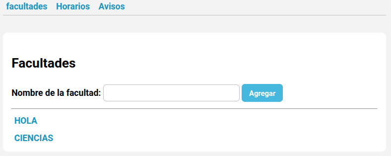

### 2.2.2 Escuelas

si se da click en una facultad
se podrán ver las escuelas existentes y tambien agregar nuevas

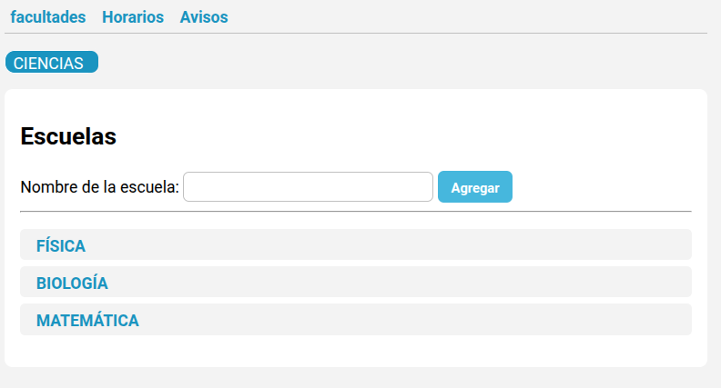

### 2.2.3 Carreras   

si se da click en una escuela
se podrán ver los cursos existentes así como agregar nuevos con nombres y cantidad de alumnos matriculados y 
vacantes disponibles

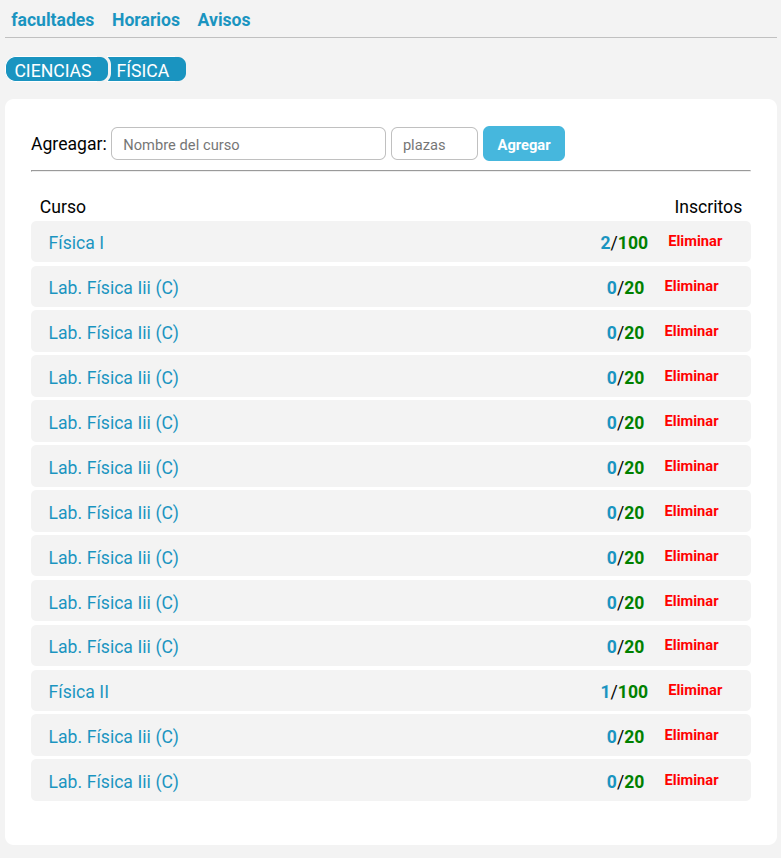

### 2.2.4 Cursos
Al hacer click en un curso
se podra ver los profesores
asignados del curso tanto como teoría y práctica.

También se podrá asignar un profesor a un curso o quitarlo.

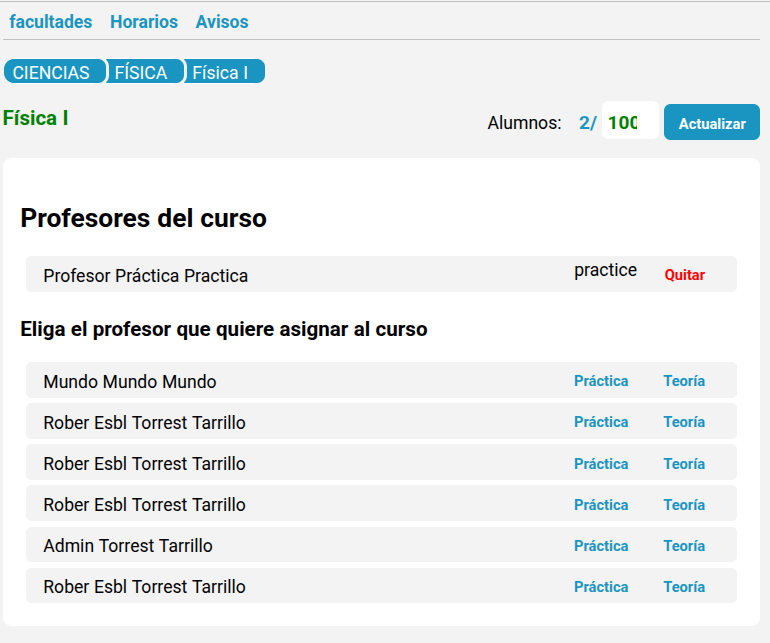

Y la lista de alumnos
matriculados en el curso asi
como también las evaluaciones
y el peso que tiene
el test y la guía de práctica

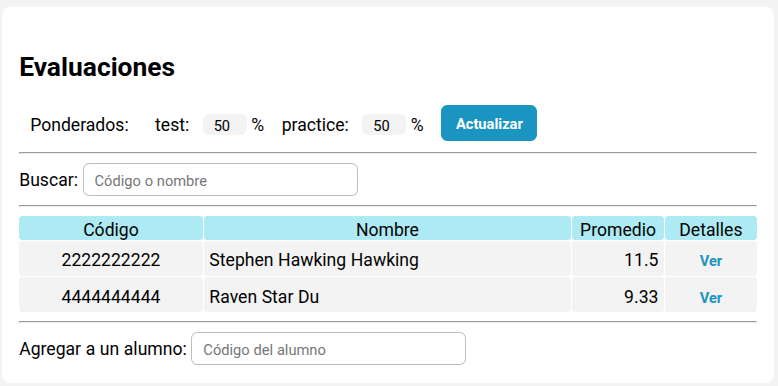

Al hacer click en ver se
podrán ver las notas detalladamente y también
se podrá modificar(Si esta
habilidado para modificar).

El promedio se realia de acuerdo a las notas acumuladas
hasta el momento

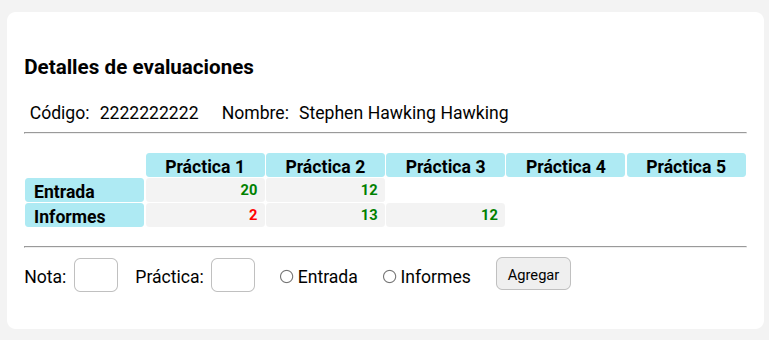

### 2.2.5 Horarios para realizar registros

En la pestaña de horarios
se podrán ver los horarios
para matricularse a un curso:
``student`` para los alumnos
``professor`` para los profesores
o para registrar las prácticas
: ``1, 2, 3, ...``
asi omo tambien se podrán eliminar

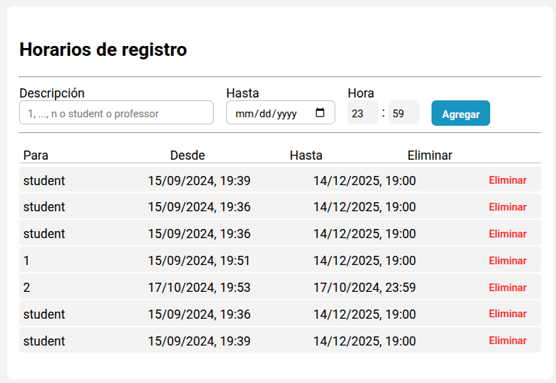

### 2.2.6 Avisos

En la pestaña de avisos
se podrán ver los avisos
que se han publicado
asi omo tambien se podrán eliminar y agregar nuevos

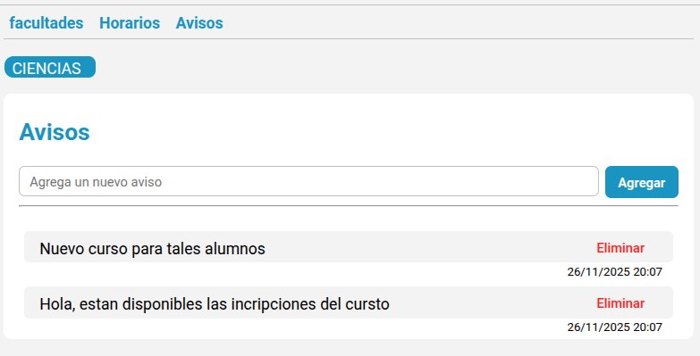

## 2.3 Alumnos

### 2.3.1 Login

El alumno puede ingresar con el lógin de la siguiente manera:

Usando su código universitario
y la contraseña

### 2.3.2 Registro
Si no están registrados aún
pueden hacerlo haciendo click en
el boton de registrate
y llenando los datos

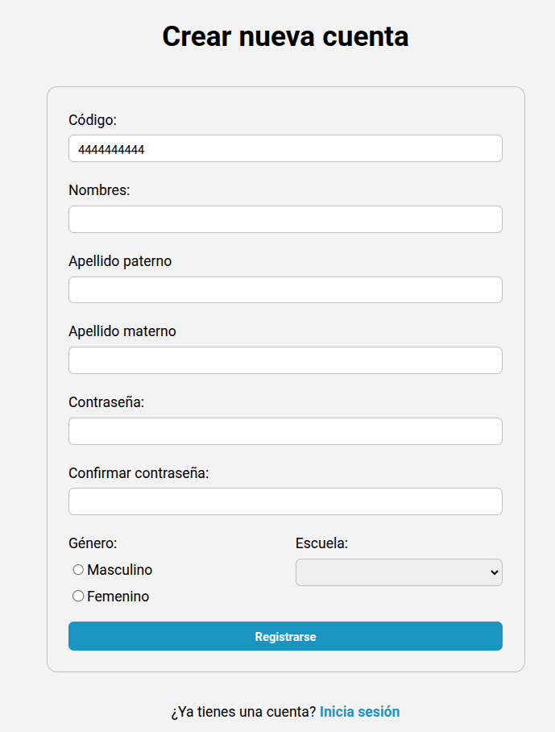

### 2.3.1 Cursos
Al momento de entrar
tendran el pefil con sus cursos y puede ver las notas
haciendo click en ver notas

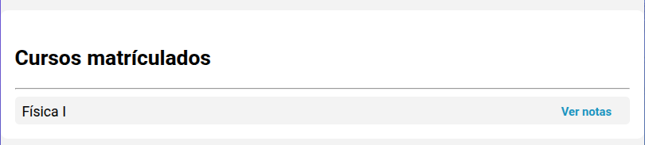

Vista de notas

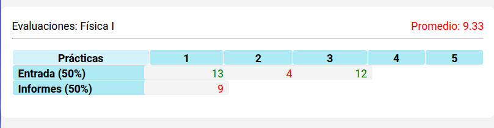
