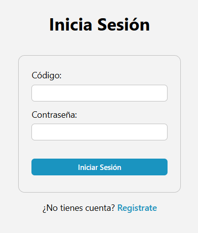
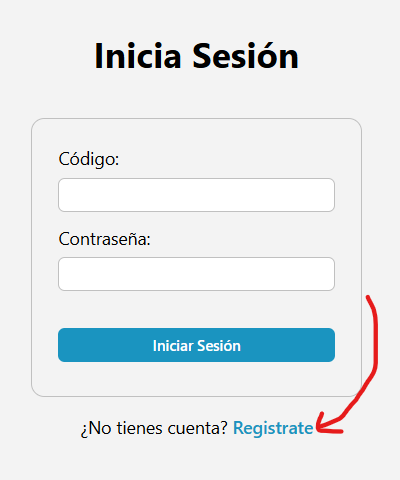

# Registro de notas para el laboratorio de Física

## 1. Técnologías utilizadas

* Base de datos: SurrealDB
* Backend: Rust (Actix Web)
* Frontend: Svelte + SvelteKit

## 2. Guía de uso

### 2.1 Profesores

A continuación se muestra la guía de uso de la sección de profesores

### 2.1.1 Login

El profesor puede ingresar con el lógin de la siguiente manera:

De click en uno de los siguientes botones:

 "pantalla principal"

Llenando el formulario:

* El código por lo general al momento de registro será el DNI
* Y la contraseña mínimo de 8 caractres

 "Login"

### 2.1.2 Registro

El profesor puede registrase haciendo click en el siguiente botón:
 "link de registro"

Llenando el formulario:
 "Registro"
