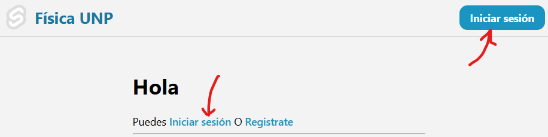

# Registro de notas para el laboratorio de Física

## 1. Técnologías utilizadas

* Base de datos: SurrealDB
* Backend: Rust (Actix Web)
* Frontend: Svelte + SvelteKit

## 2. Guía de uso

### 2.1 Profesores

A continuación se muestra la guía de uso de la sección de profesores

### 2.1.1 Login

El profesor puede ingresar con el lógin de la siguiente manera:

De click en uno de los siguientes botones:

 "pantalla principal"

Llenando el formulario:

* El código por lo general al momento de registro será el DNI
* Y la contraseña mínimo de 8 caractres

### 2.1.2 Registro

El profesor puede registrase haciendo click en el siguiente botón:

 "link de registro"

Llenando el formulario:

Luego de registrarse ir a iniciar seción:

### 2.1.3 Cursos

Una vez iniciada sesión el profesor puede acceder a a la lista de cursos asignados

Al dar click en un curso le aparecerá los alumnos que pertenecen
y los detalles del curso:

Y si se da click en ver (como se muestra en la parte superior)
si es profesor de práctica podrá modificar las notas, sino, solo verlas.

